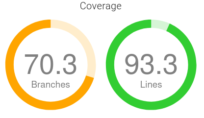

# Antman

## Warning
This projet has been made public in order to show my skills. Attention for EPITECH students for **-42**

## Description
Antman is a project of the **Elementary Programming²** of the first semester of first year at Epitech. The goal of the project is to make two programs that compress and decompress files. This project was completed in 3 weeks.

## Install and Run the project
To install and run the two programs. Please run the following commands in a terminal.

Clone repository:
```bash
$> git clone git@github.com:ZerLock/EPITECH-Antman.git
$> cd EPITECH-Antman
```

Compile the project
```bash
$> make re
```

Run the compress program
```bash
$> ./antman/antman *decompressed file* 1
```

Run the decompress program
```bash
$> ./giantman/giantman *compressed file* 1
```

## Results
Coverage (Unit Tests) :<br/>


Note : **53.4%** passed - **1/20** (*Too Many Coding Style Errors due to unit test files saved in wrong places*)<br/>
Module Grade : **A**

## Mainteners

- [Léo Dubosclard](https://github.com/ZerLock)
- [Jules Bobillot](https://github.com/Bules)